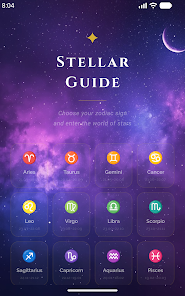
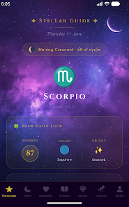
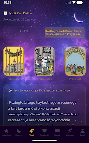

# ✨ Gwiezdny Przewodnik (Stellar Guide)

Aplikacja astrologiczna na Androida (React Native / Expo) — horoskopy, tarot, kompatybilność znaków, dziennik snów i energie kosmiczne, generowane na żywo przez AI, w dwóch wersjach językowych (PL/EN).

An astrology app for Android (React Native / Expo) — daily horoscopes, tarot readings, sign compatibility, a dream journal and cosmic energy forecasts, generated live by AI, fully bilingual (PL/EN).

📲 **[Pobierz z Google Play](https://play.google.com/store/apps/details?id=com.Pokekage.gwiezdnyprzewodnik)**

<p align="center">
  
  
  
</p>

---

## 🇵🇱 Polski

### O aplikacji

Gwiezdny Przewodnik to kompletna aplikacja astrologiczna z ośmioma modułami dostępnymi z dolnej nawigacji:

- **Horoskop** — codzienny horoskop dopasowany do znaku zodiaku użytkownika, generowany przez AI.
- **Księżyc** — aktualna faza Księżyca i jej znaczenie astrologiczne.
- **Tarot** — losowanie kart i interpretacja w kontekście pytania użytkownika.
- **Zgodność** — sprawdzanie kompatybilności dwóch znaków zodiaku (tryby: miłość, praca, przyjaźń).
- **Sennik** — dziennik snów z interpretacją symboliki.
- **Kosmos** — energie astrologiczne dnia, tygodnia i miesiąca (planeta dnia, afirmacje, tranzyty).
- **Ebook** — płatny, wbudowany w aplikację przewodnik po astrologii (jednorazowy zakup przez Google Play Billing).
- **Profil** — dane urodzenia, wyliczany Ascendent, numerologia (Liczba Drogi Życia), ulubione horoskopy, powiadomienia, ustawienia prywatności (RODO).

Dodatkowo: widget na ekranie głównym Androida z horoskopem dnia, powiadomienia push (codzienny horoskop + fazy Księżyca), pełna lokalizacja PL/EN.

### Stos technologiczny

- **React Native 0.81** + **Expo SDK 54**, nawigacja: React Navigation (bottom tabs)
- Treści generowane przez **Groq API** (modele `openai/gpt-oss-20b`/`120b`), z opcjonalnym backendem-proxy (Cloudflare Worker w `server/groq-proxy/`), żeby klucz API nie musiał trafiać do klienta
- Monetyzacja: **Google AdMob** (baner, pełny ekran, reklamy z nagrodą) + **Google Play Billing** przez `expo-iap` (ebook jako produkt jednorazowy)
- Widget na pulpit: `react-native-android-widget`
- Powiadomienia lokalne: `expo-notifications`
- Dane użytkownika trzymane lokalnie na urządzeniu: `@react-native-async-storage/async-storage`
- Lokalizacja: `i18n-js` (polski / angielski)

### Uruchomienie lokalnie

```bash
git clone https://github.com/Pokekage/Aplikacja-Gwiezdny-Przeowdnik.git
cd Aplikacja-Gwiezdny-Przeowdnik
npm install
```

Utwórz plik `.env` w katalogu głównym z własnym kluczem Groq:

```
EXPO_PUBLIC_GROQ_KEY=twój_klucz_z_console.groq.com
```

Następnie:

```bash
npx expo start
```

Do builda produkcyjnego (Android) używane jest EAS Build:

```bash
eas build --platform android --profile production
```

### Struktura projektu

```
src/
  screens/     — ekrany aplikacji (jeden plik na moduł z listy wyżej)
  components/  — komponenty współdzielone (np. AdBanner)
  utils/       — logika: klient AI (astro.js), i18n, powiadomienia, IAP, numerologia, storage
  widgets/     — widget na ekran główny Androida
server/
  groq-proxy/  — opcjonalny Cloudflare Worker jako proxy do Groq (klucz API nie trafia do klienta)
```

---

## 🇬🇧 English

### About

Gwiezdny Przewodnik (Stellar Guide) is a complete astrology app with eight modules available from the bottom navigation:

- **Horoscope** — a daily horoscope tailored to the user's zodiac sign, generated by AI.
- **Moon** — the current Moon phase and its astrological meaning.
- **Tarot** — card draws with an interpretation in the context of the user's question.
- **Compatibility** — checks compatibility between two zodiac signs (love / work / friendship modes).
- **Dreams** — a dream journal with symbolic interpretation.
- **Cosmos** — daily, weekly and monthly astrological energies (planet of the day, affirmations, transits).
- **Ebook** — a paid, bundled astrology guide (one-time purchase via Google Play Billing).
- **Profile** — birth data, a calculated Ascendant, numerology (Life Path Number), favorite horoscopes, notification settings, and privacy (GDPR) controls.

Also included: an Android home-screen widget showing the daily horoscope, push notifications (daily horoscope + Moon phases), and full PL/EN localization.

### Tech stack

- **React Native 0.81** + **Expo SDK 54**, navigation via React Navigation (bottom tabs)
- Content generated by the **Groq API** (`openai/gpt-oss-20b`/`120b` models), with an optional proxy backend (Cloudflare Worker in `server/groq-proxy/`) so the API key never has to ship in the client
- Monetization: **Google AdMob** (banner, interstitial, rewarded) + **Google Play Billing** via `expo-iap` (the ebook as a one-time non-consumable product)
- Home-screen widget: `react-native-android-widget`
- Local notifications: `expo-notifications`
- User data stored locally on-device: `@react-native-async-storage/async-storage`
- Localization: `i18n-js` (Polish / English)

### Running locally

```bash
git clone https://github.com/Pokekage/Aplikacja-Gwiezdny-Przeowdnik.git
cd Aplikacja-Gwiezdny-Przeowdnik
npm install
```

Create a `.env` file in the project root with your own Groq key:

```
EXPO_PUBLIC_GROQ_KEY=your_key_from_console.groq.com
```

Then:

```bash
npx expo start
```

Production Android builds use EAS Build:

```bash
eas build --platform android --profile production
```

### Project structure

```
src/
  screens/     — app screens (one file per module listed above)
  components/  — shared components (e.g. AdBanner)
  utils/       — logic: AI client (astro.js), i18n, notifications, IAP, numerology, storage
  widgets/     — Android home-screen widget
server/
  groq-proxy/  — optional Cloudflare Worker acting as a proxy to Groq (keeps the API key server-side)
```

---

## 📄 Licencja / License

© 2026 Damian Jackiewicz (Pokekage). **Wszystkie prawa zastrzeżone / All rights reserved.**

Ten kod jest publicznie widoczny wyłącznie w celach portfolio/demonstracyjnych. Nie jest to open source — kopiowanie, modyfikowanie, dystrybucja ani wykorzystanie kodu (w całości lub części) bez pisemnej zgody autora jest zabronione. Szczegóły: [`LICENSE`](./LICENSE).

This code is made publicly visible for portfolio/demonstration purposes only. It is not open source — copying, modifying, distributing or otherwise using this code (in whole or in part) without the author's written permission is not allowed. See [`LICENSE`](./LICENSE) for details.
